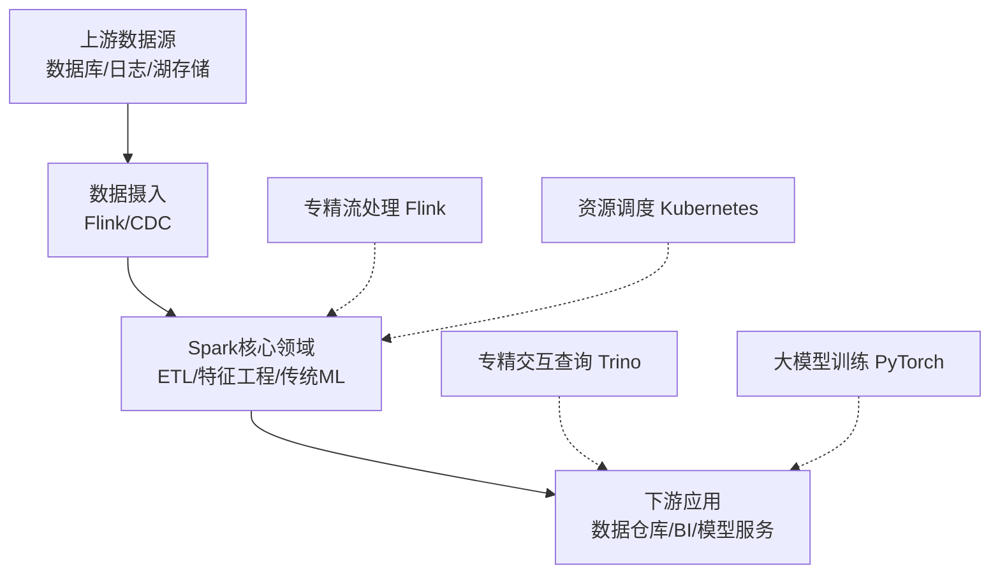

## Spark核心精要：从统一引擎到技术生态枢纽
> 关于Spark核心技术原理及其在技术生态中定位的深入讨论

### 📌 今日核心洞察

Apache Spark并非一个孤立的大数据框架，而是一个现代化的、高效的“**数据处理超级中央厨房**”。其强大之处并非在于能包办一切，而在于它作为**数据枢纽**的核心定位，通过“**统一API+统一引擎**”的设计哲学，与上下游专精技术栈协同，构建完整的数据与AI管线。

### 1. 🔧 Spark的“统一性”是如何实现的？

- **并非重写语言**，而是通过一套**嵌入式领域特定语言（eDSL）**（如DataFrame/Dataset API）。
- 用户用Python/Scala/Java/R编写的代码，都会被Spark的**Catalyst优化器**解析、优化并生成一个**统一的逻辑与物理计划**（中间表示）。
- 最终由**Tungsten引擎**编译为高性能的字节码，在集群上分布式执行。
- **结果**：多种语言前端 → 统一的中间表示 → 统一的执行引擎。实现了开发体验与执行效率的双重统一。

### 2. 🗺️ Spark在现代技术栈中的定位

Spark已演进为数据处理生态的**核心枢纽**，其上下游由更专精的技术栈协同配合，共同构成现代数据平台：

- **Spark的核心优势领域**：大规模**批处理ETL**、**特征工程**、**传统机器学习**（如梯度提升树、线性模型）。
- **与专精技术栈的协同**：
  - **流处理**：Flink处理超低延迟实时流，Spark接手后续批量计算。
  - **交互式查询**：Trino/Presto/ClickHouse提供亚秒级查询，Spark准备数据。
  - **大模型训练**：**Spark负责数据预处理**，PyTorch/TensorFlow集群负责分布式训练。
  - **资源调度**：Kubernetes (K8s) 逐渐成为云原生时代部署和管理Spark等应用的标准。

### 3. ⚠️ Spark面临的挑战与边界

- **大模型训练**：Spark的通信模型不适合GPU间高频度的梯度同步，其主要价值在于**为AI训练提供高质量、大规模的数据预处理**。
- **超低延迟流处理**：微批处理模型使其在毫秒级延迟场景下逊于Flink等真流处理引擎。
- **极速即席查询**：OLAP数据库（ClickHouse, Druid）在点查速度上更具优势。

---

### 💡 Thinking

欢迎在评论区分享你的看法和实践经验！

1.  **实践之选**：在你的项目中，Spark主要承担什么样的角色？是纯粹的ETL工具，还是机器学习平台？你们是如何将Spark与其他技术（如Flink、专有数据库或机器学习框架）组合使用的？遇到了哪些挑战？
2.  **未来之思**：随着大模型和AI原生应用的爆发，Spark的“数据预处理”核心价值会变得越来越重要，还是会被更深度的AI框架（如PyTorch DataLoader的分布式进化）所替代？
3.  **架构之辩**：你认为“一个统一的强大引擎”（如Spark）和“多个最佳实践工具的组合”（如Flink+Trino+PyTorch），哪种架构更适合未来的数据平台？为什么？

--- 
🎗️Welcome to flowwer My GitHub
